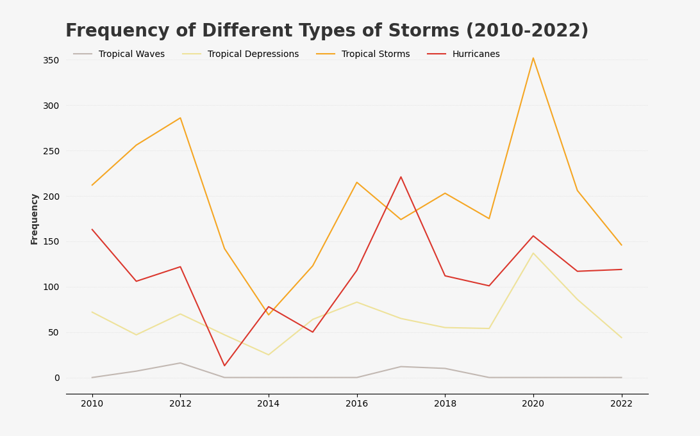

# Storms Analysis (2010-2022)

This repository contains a Python script (`storms.py`) that analyzes the frequency of different types of storms from 2010 to 2022. The script uses data from the National Oceanic and Atmospheric Administration (NOAA) and visualizes the data using the `matplotlib` library.

## Dataset
The dataset used in this analysis is sourced from the National Oceanic and Atmospheric Administration (NOAA), an agency that provides scientific data related to weather, climate, and the environment. The dataset contains information about various storm statuses, including hurricanes, tropical storms, tropical depressions, and tropical waves.

You can access the dataset directly from the following URL:
- [NOAA Storms Dataset](https://raw.githubusercontent.com/JosephBARBIERDARNAL/data-matplotlib-journey/refs/heads/main/storms/storms.csv)

## Overview

This script performs the following tasks:
1. Process/cleans the data.
2. Groups the data by year and storm status.
3. Filters the data into separate DataFrames for each storm status:
    - Hurricanes
    - Tropical Storms
    - Tropical Depressions
    - Tropical Waves

## Data Visualization
Creates a line graph using matplotlib to visualize the frequency of each storm type over the years (2010-2022).

<b> Graph Features: </b>
- Title: "Frequency of Different Types of Storms (2010-2022)"
- Y-axis: Frequency of storms.
- Legend: Displays the different storm types with corresponding colors.
- Grid: Light grey grid lines for easier interpretation of the data.
- Custom Colors: Each storm type is represented by a distinct color.

## Requirements
To run the script, you need the following Python libraries:
- pandas
- matplotlib

## Output
The script will generate a line graph displaying the frequency of different storm types (hurricanes, tropical storms, tropical depressions, and tropical waves) from 2010 to 2022.

